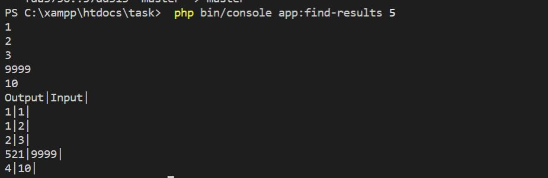
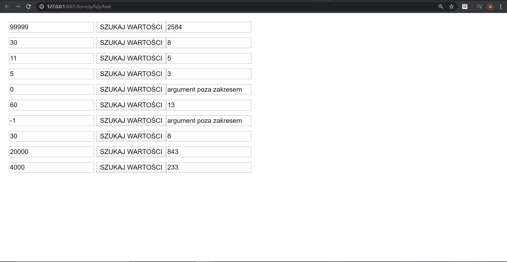

The project to be run  it uses XAMPP:
1)to run the command:
  - the solution in Symfony, the command:
  installation(a command needs to be run): composer require symfony/console
  composer require symfony/maker-bundle --dev
  composer require doctrine/annotations

  To run the command please type: php bin/console app:find-results <NUMBER_OF_TESTS>
  If no argument is passed, then the default number of test cases is 10. 
  Solution:
  

  2) as for the form:
  run the command:  composer require symfony/form
   composer require symfony/twig-bridge
   composer require symfony/twig-bundle
   Run symfony server:start and start xampp(Apache)and then go http://127.0.0.1:8001/form/p/h/p/task
Solution:
